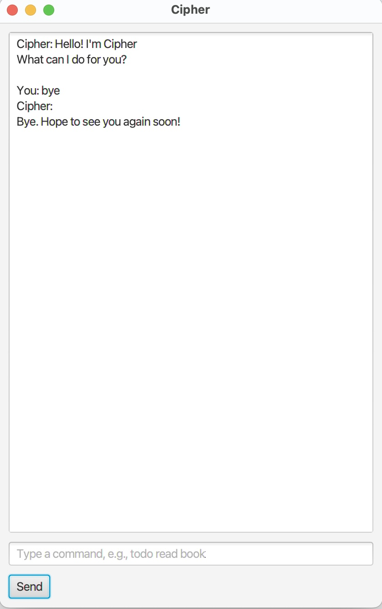

# Cipher User Guide



Cipher is a lightweight task management chatbot that helps you manage todos, deadlines, and events using simple commands.

## Quick Start

1. Ensure you have Java installed.
2. Download the latest `.jar` file from the repository releases.
3. Open a terminal in the folder containing the jar file.
4. Run the app:

```bash
java -jar cipher.jar
```

## Features

### 1. View all tasks: `list`

Shows all tasks currently stored in the task list.

**Format**
```text
list
```

### 2. Add a todo: `todo`

Adds a todo task.

**Format**
```text
todo DESCRIPTION
```

**Example**
```text
todo read book
```

### 3. Add a deadline: `deadline`

Adds a deadline task with a due date or date-time.

**Format**
```text
deadline DESCRIPTION /by yyyy-MM-dd
deadline DESCRIPTION /by yyyy-MM-dd HHmm
```

**Examples**
```text
deadline return book /by 2026-03-01
deadline submit report /by 2026-03-01 1800
```

### 4. Add an event: `event`

Adds an event task with a start and end date-time.

**Format**
```text
event DESCRIPTION /from yyyy-MM-dd HHmm /to yyyy-MM-dd HHmm
```

**Example**
```text
event project meeting /from 2026-03-05 1400 /to 2026-03-05 1600
```

### 5. Mark a task as done: `mark`

**Format**
```text
mark TASK_NUMBER
```

### 6. Unmark a task: `unmark`

**Format**
```text
unmark TASK_NUMBER
```

### 7. Delete a task: `delete`

**Format**
```text
delete TASK_NUMBER
```

### 8. Find tasks by keyword: `find`

Finds tasks whose descriptions contain the given keyword (case-insensitive).

**Format**
```text
find KEYWORD
```

**Examples**
```text
find book
find BOOK
```

### 9. Snooze a deadline (BCD Extension): `snooze`

Reschedules a **deadline task** to a new date or date-time.

> Only deadline tasks can be snoozed.

**Format**
```text
snooze TASK_NUMBER /to yyyy-MM-dd
snooze TASK_NUMBER /to yyyy-MM-dd HHmm
```

**Examples**
```text
snooze 5 /to 2026-02-25
snooze 5 /to 2026-02-25 1800
```

### 10. Exit the application: `bye`

**Format**
```text
bye
```

## Command Summary

| Action | Format |
|---|---|
| List tasks | `list` |
| Add todo | `todo DESCRIPTION` |
| Add deadline | `deadline DESCRIPTION /by yyyy-MM-dd [HHmm]` |
| Add event | `event DESCRIPTION /from yyyy-MM-dd HHmm /to yyyy-MM-dd HHmm` |
| Mark task | `mark TASK_NUMBER` |
| Unmark task | `unmark TASK_NUMBER` |
| Delete task | `delete TASK_NUMBER` |
| Find tasks | `find KEYWORD` |
| Snooze deadline | `snooze TASK_NUMBER /to yyyy-MM-dd [HHmm]` |
| Exit | `bye` |

## Notes

- `TASK_NUMBER` refers to the number shown in the `list` command.
- Dates use the format `yyyy-MM-dd` (e.g. `2026-02-25`).
- Date-time uses the format `yyyy-MM-dd HHmm` (e.g. `2026-02-25 1800`).
- Cipher handles common input mistakes by showing an error message and allowing you to continue.

## FAQ / Troubleshooting

### Q: I typed an invalid command.
Cipher will show an error message. Check the command format in this guide and try again.

### Q: My data file is missing.
Cipher will create a new data file automatically when needed.

### Q: Why is my task number invalid?
Make sure the task number exists in the current list and is within range.

## Acknowledgements

- Built as part of the NUS CS2103 iP (individual project).
- Some enhancements (e.g., code refinement and documentation drafting) were completed with AI assistance.
